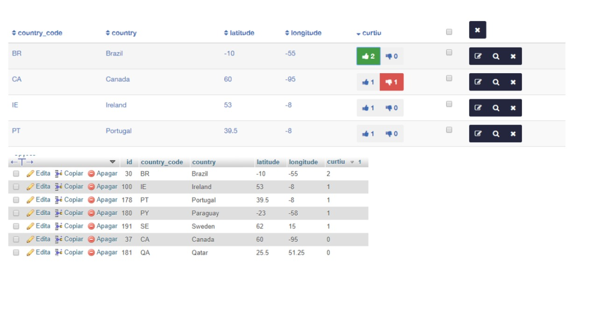
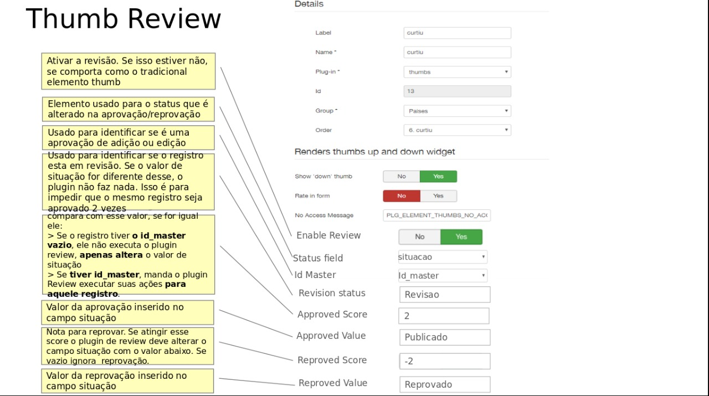

# Plugin Thumbs Master

 

## Conteudo

- [Plugin](#plugin)

## Plugin

O plugin Thumb Review. 

- A logica continua igual o usuário através de plugin suggest, cria uma nova versão sugerida do registro para revisar

- O plugin review também continua ativado e também pode continuar funcionado no afterProcesso do formulário

- A diferença é: quando um determinado registro a Revisar atingi um determinado valor de votos positivos (somatório que fica armazenado na coluna do elemento thumb) o plugin thumb faz uma chamada para o    plugin review executando-o.

Isso permite que a Tomada de Decisão seja uma Aprovação Democrática realizada pela comunidade de usuários ao invés de ser de forma autocrática por um só usuário

    

    

